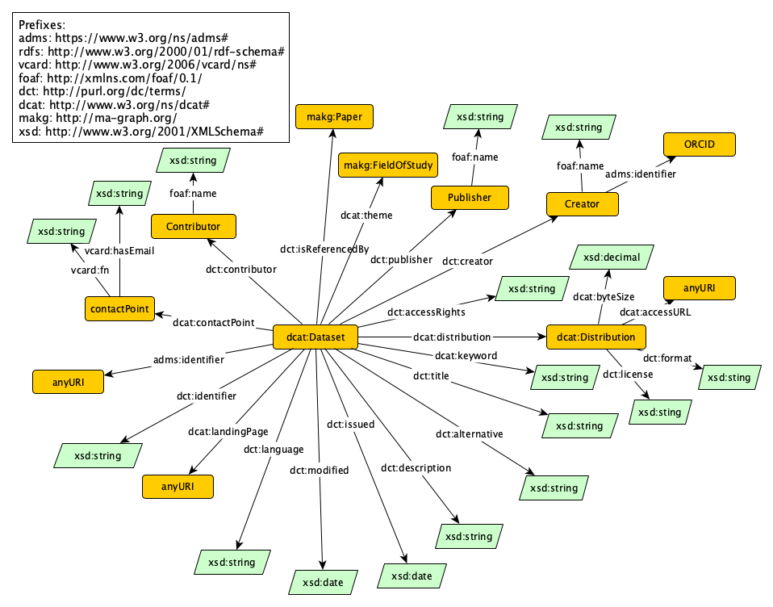

# Dataset Knowledge Graph (DSKG)

## Abstract
We present an approach for constructing an RDF knowledge graph for Datasets. To build the knowledge graph, we use datasets registered in OpenAIRE and Wikidata.
We identify all publications out of 146 million scientific publications which contain mentions of datasets, and establish links between the dataset and publication representations in the [Microsoft Academic Knowledge Graph](http://ma-graph.org). As the author names of datasets can be ambiguous, we develop and evaluate a method for author name disambiguation and enrich the knowledge graph with links to [ORCID](https://orcid.org). Overall, our knowledge graph contains 2,208 datasets with associated properties, as well as 813,551 links to scientific publications. It can be used for a variety of scenarios, facilitating advanced dataset search systems and new ways of measuring and awarding the provisioning of datasets.
The constructed dataset knowledge graph (DSKG) is publicly available at [http://dskg.org](http://dskg.org).

  

<figcaption align="middle">Schema auf the DSKG</figcaption>

<figure>
    
    <figcaption>An elephant at sunset</figcaption>
</figure>
    

The repository provides all the scripts needed to create the knowledge graph semi-automatically. The following manuel explains how to create the knowledge graph. 

## Knowledge Graph Construction

We use the following database with metadata about datasets for the creation of the DSKG: 
1. OpenAIRE-Dataset: We consider a subset of the [OpenAIRE Research Graph dump](https://zenodo.org/record/3516918) which contains metadata about datasets. The used dump is created with this code: [https://github.com/michaelfaerber/OpenAIRE](https://github.com/michaelfaerber/OpenAIRE).
2. Wikidata-Dataset: We use instances of the classes of [Wikidata](https://www.wikidata.org/wiki/Wikidata:Main_Page) which represent datasets. The instances of the [relevant classes](wikidata-dataset/SPARQL_wikidata_dataset.txt) and their properties can be accessed based on semantic querys via the publicly available [Wikidata SPARQL endpoint](https://query.wikidata.org).

### Identify publications from the MAG which contain mentions of datasets
We use a string-based algorithm to detect mentions of datasets in papers. We use the files containing the paper abstracts and citation context of the MAG-dump for the matching. For dataset from OpenAIRE, we use the following metadata information to recognize dataset in the files: [``title``](string-matching-MAKG-dumps/data/OpenAIRE_title.txt), [``originalId``](string-matching-MAKG-dumps/data/OpenAIRE_originalId.txt) and [``doi``](string-matching-MAKG-dumps/data/OpenAIRE_doi.txt). For dataset from Wikidata, we use: [``itemLabel``](string-matching-MAKG-dumps/data/Wikidata_itemLabel.txt), [``altLabel``](string-matching-MAKG-dumps/data/WikidataAltLabel.txt), [``officialWebsite``](string-matching-MAKG-dumps/data/Wikidata_owebsite.txt), [``workURL``](string-matching-MAKG-dumps/data/Wikidata_workURL.txt) and [``url``](string-matching-MAKG-dumps/data/Wikidata_url.txt).

  1. The first step is to filter out the most frequently used English words for the match. The following Script calculates this not considered intersection: [``match_text_corpus.py``](string-matching-MAKG-dumps/match_text_corpus.py)
  2. For then run the script for the matching. MAG dumps are used as input and the output are text files with the matches found: [``string_based_matching_MAKG.py``](string-matching-MAKG-dumps/string_based_matching_MAKG.py)
  3. After that, the results are filtered using the created filter list to reduce false matches: [``filterwords_matching.py``](string-matching-MAKG-dumps/filterwords_matching.py)
  4. The following script inserts the found matches into these initial datasets (csv-files) of the OpenAIRE and Wikidata dataset: [``MAKG_links_in_csv.py``](string-matching-MAKG-dumps/MAKG_links_in_csv.py). In the following we will only use the metadata records for which at least one link could be found.

### Transform tabular metadata to RDF and assign URIs for entities
We implemented the data transformation of the original metadata using SPARQL CONSTRUCT and SPARQL INSERT querys in [Ontotext's GraphDB graph database](https://graphdb.ontotext.com).

  1. Clean up the OpenAIRE dataset (csv-file) entries and adapt the metadata entries of the size property to DCAT: [``preprocessing_OpenAIRE.py``](dskg-construction/preprocessing_OpenAIRE.py)
  2. Perfom the classification of the metadata entries for OpenAIRE and Wikidata according to DCAT: [``classification_resources.py``](dskg-construction/classification_resources.py)
  3. In GraphDB: Create beta version of the DSKG where the properties are mapped to DCAT but no URIs for the resources are assigned yet. The creation of the dskg-beta-version is realized with SPARQL CONSTRUCT and INSERT ([``SPARQL_CONSTRUCT_openAIRE_beta_version.txt``](dskg-construction/SPARQL-dskg-beta-version/SPARQL_CONSTRUCT_openAIRE_beta_version.txt) and  [``SPARQL_CONSTRUCT_wikidata_beta_version.txt``](dskg-construction/SPARQL-dskg-beta-version/SPARQL_CONSTRUCT_wikidata_beta_version.txt) querys for the OpenAIRE and Wikidata dataset in tabular form (csv-files). For the further steps, the beta version of the dskg is compiled as a table form using a [SPARQL SELECT](dskg-construction/dskg_table_format.txt) query in GraphDB.
  4. Use the file ``PaperFieldsOfStudy.txt`` from the MAG-dump, the dskg-beta-version and the Jupyter Notebook [``fields_of_application.ipynb``](dskg-construction/fields_of_application.ipynb) to determine the fields of applications of the datasets and add it to the dskg-beta-version.
  5. Perform the author disambiguation explained in the paragraph below.
  6. Assignment of unique URIs for the entities in the dskg-beta-version (uses the results of the performed author disambiguation): [assign_uris_for_entities.py](dskg-construction/assign_uris_for_entities.py)
  7. Load the enriched information from the dskg-beta version into the classified OpenAIRE and Wikidata dataset for the final construction of the KG. Create csv files from the dskg-beta-version for each classes of entities in the metadata: [``final_csv_files_transformation_dcat.ipynb``](dskg-construction/final_csv_files_transformation_dcat.ipynb)
  8. Load the generated [csv files](dskg-construction/csv-files/) into a GraphDB Repository and transform the table data into RDF using the [SPARQl CONSTRUCT and SPARQl INSERT](dskg-construction/SPARQL-dskg/) querys to construct the final DSKG. 
  
Note on using SPARQL CONSTRUCT and INSERT querys in GraphDB:
The SPARQL INSERT querys are identical except for the replacement of the keyword (INSERT instead of CONSTRUCT, the removal of the LIMIT 100 restriction and the addition of the corresponding SPARQL endpoint within the WHERE clause: ``WHERE { SERVICE <ontorefine:99999999999> {...} }``.
``<ontorefine:99999999999>`` is an example for a SPARQL endpoint in GraphDB.
  
 

  
### Author Disambiguation
 1. Perform a [SPARQL Query](author-disambiguation/LDA-model/lda_table_SPARQL.txt) over the dskg-beta-version to get a table with the relevant information of the datasets for the LDA model.
 2. Calculate the LDA vectors for the data sets and load it into the dskg-beat-version for the author disambiguation with the Jupyter Notebook [``LDA-Modell.ipynb``](author-disambiguation/LDA-model/LDA-Modell.ipynb).
 3. Perfom the author disambiguation with the Jupyter Notebook [``author_disambiguation.ipynb``](author-disambiguation/author_disambiguation.ipynb). use the dskg-beat-version from the LDA-Modell as input.
    The Code first creates a [txt-file](author-disambiguation/data/Author_Disambiguation.txt) that contains all the necessary information for the author disambiguation which is then used to perform the author disambiguation.

  
## Linking the authors of the DSKG to ORCID
  1. Perform a [SPARQL Query](linking-to-ORCID/01SPARQL_author_profiles.txt) over the dskg to get a table with the authors profiles from the knowledge graph.
  2. Query the titles of the linked papers using the MAKG SPARQL endpoint: [``02MAKG_paper_titels.py``](linking-to-ORCID/02MAKG_paper_titels.py)
  3. Query of author names via the ORCID API: [``03ORCID_API.py``](linking-to-ORCID/03ORCID_API.py)
  4. Perform the linking to ORCID by running the Script that compares the author profiles: [``04linking_authors_to_orcid.py``](linking-to-ORCID/04linking_authors_to_orcid.py)
  5. Insert the found ORCID IDs of the authors into the csv-file which contains the metadata of the authors: [``05add_ORCID_IDs_to_csv.py``](linking-to-ORCID/05add_ORCID_IDs_to_csv.py)
  6. Add the ORCID-IDs to the knowledge graph in GraphDB using [SPARQL CONSTRUCT and SPARQL INSERT](dskg-construction/SPARQL-dskg/CONSTRUCT_CreatorPerson.txt).

 
  

